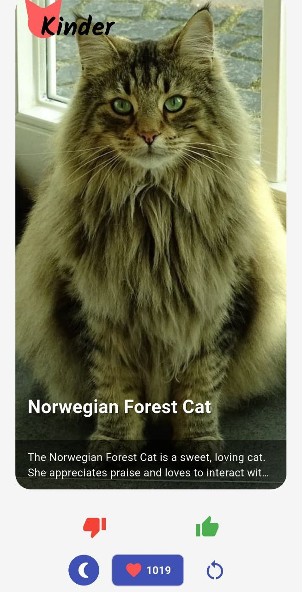
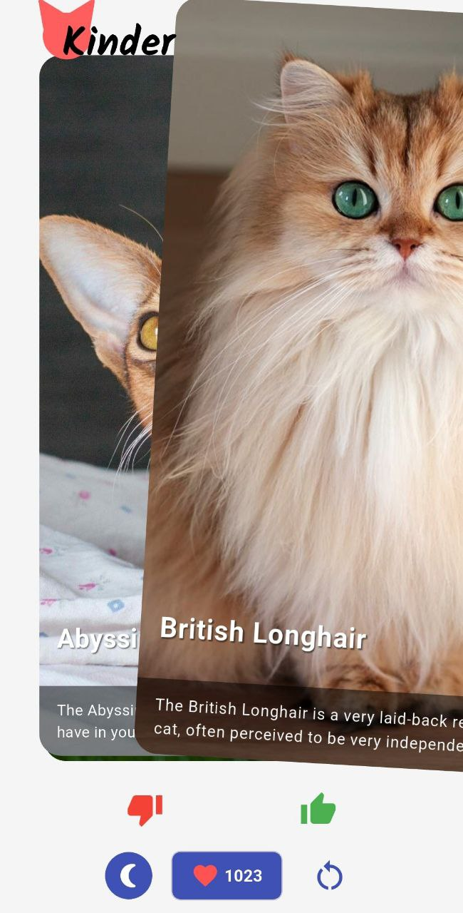
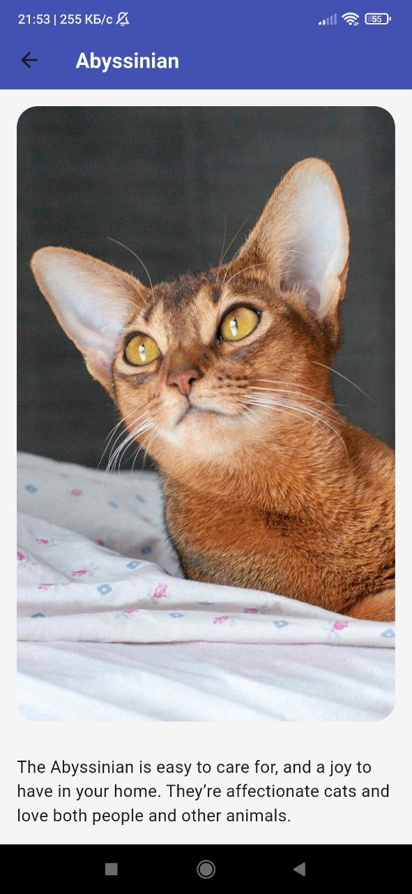
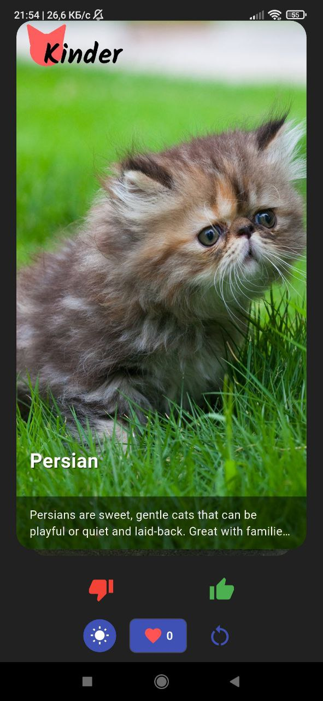
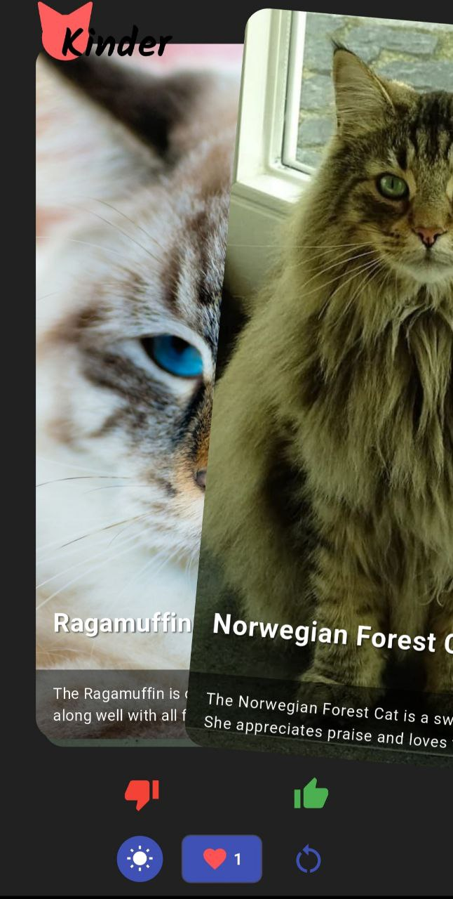
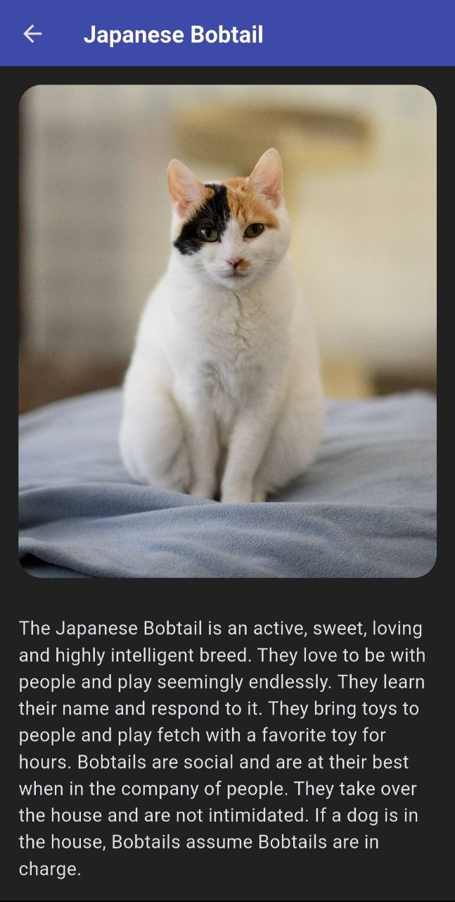
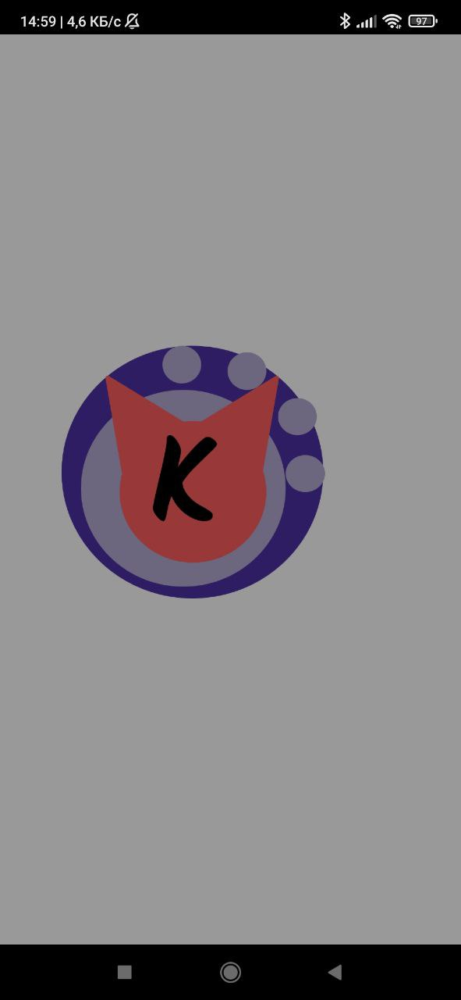
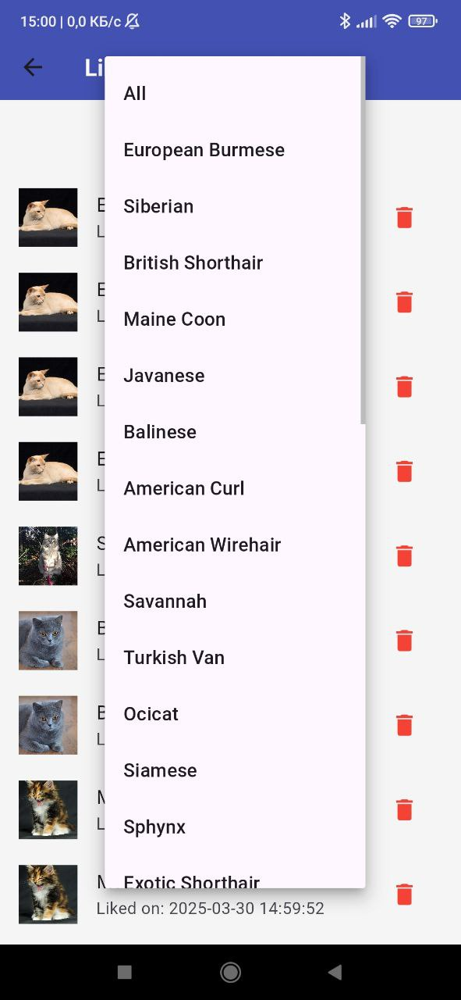
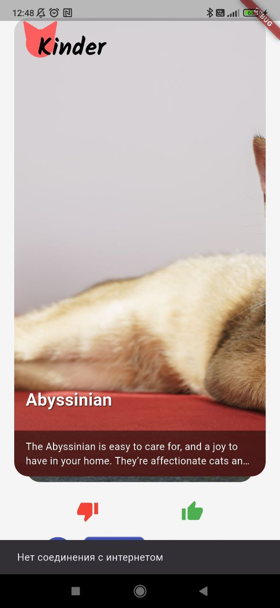

# Kinder - Tinder for Cats

## Описание проекта
Данный проект реализован в рамках курса "Разработка на Flutter" в ВШПИ. В рамках этого проекта нам было необходимо реализовать подобие тиндера, но для котов

### Реализованные фичи
- На главном экране отображается случайное изображение котика и название его породы
- Изображение котика можно свайпнуть или смахнуть влево или вправо
- Также есть две кнопки: лайк/дизлайк
- Смахивание, свайп или нажатие на кнопку сменяет котика на нового
- Если котика лайкнули (лайк или свайп вправо), то на экране увеличивается счетчик
- Счетчик можно обнулить с помощью кнопки
- Если нажать на само изображение котика, то открывается новый экран с детальным описанием
- На экране детального описания отображается то же изображение котика, плюс отображается вся информация про породу
- Есть пасхалка, что меняет API для котов на другую
- Для ее активации нужно 5 раз нажать на логотип, тогда счетчик лайков станет равен 999, это значит что пасхалка активировалась. Далее нужно просто свапать изображения котов, пока не случится что-то странное...
- Экран списка лайкнутых котиков (хранится в рантайме):
  - Отображение изображения, породы и даты лайка
  - Удаление котика из списка
  - Фильтрация по породе с мгновенным обновлением
- Прогресс-бар при загрузке изображений.
- В случае отсутствия сети, в нижней части экрана будет сообщение о том, что нет подключения к интернету и приложение перейдет в офлайн режим
- В офлайн режиме котики, что были загружены во время онлайн режима, подгружаются из локальной базы данных
- Лайки/дизлайки сохраняются между выходами из приложения
- Изображения котиков кэшируются и доступны без сети

### Примеры
#### Светлая тема

#### Темная тема

#### Загрузка

### Список лайкнутых

### Отсутсвие сети

<a href="https://minhaskamal.github.io/DownGit/#/home?url=https://github.com/ProgiFrogi/Kinder/blob/second_iteration/apk/kinder.apk">APK</a>

## Технические детали
- Язык: Dart
- Фреймворк: Flutter
- Управление состоянием: Cubit (flutter_bloc)
- Внедрение зависимостей: get_it
- Форматирование кода: `dart format`
- Анализ кода: `flutter analyze`
- Структура: Data, Domain, Presentation
- БД: Drift
- Интеграция кэширования изображений через `cached_network_image`
- Использование пакета `connectivity_plus` для проверки наличия сети
- Добавлены тесты
- использует `Snackbar` для отображения статуса сети (в ТЗ требуется, чтобы он появлялся когда пропадает интернет соединение)

## Баги
- Если картинка котика не успела скачатся и приложение перешло в онлайн-режим, то у картинок, что не были скачены будет отображатся иконка об этом, но при этом не будет возможности их свапать. Решение: использовать кнопки лайк/дизлайк, тогда они будут свапнуты с экрана