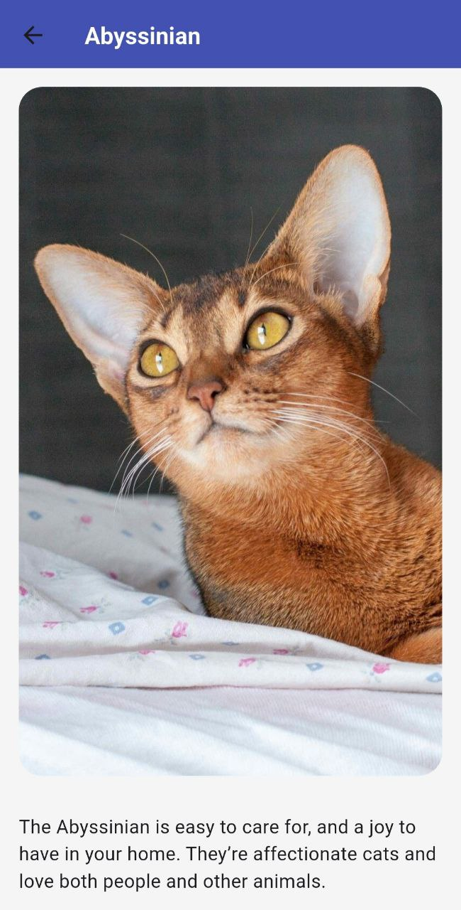
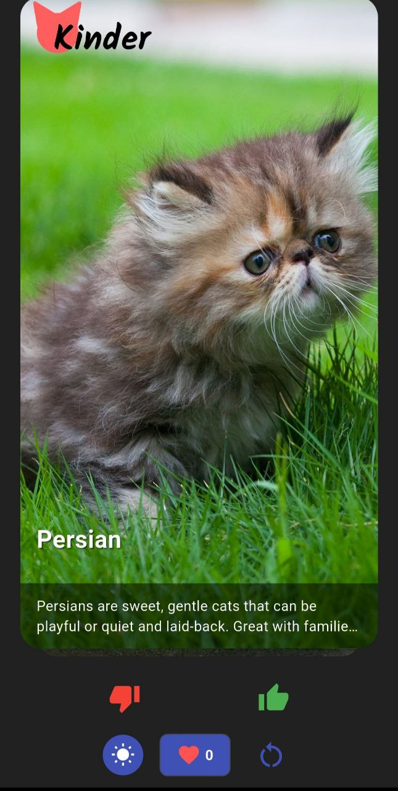
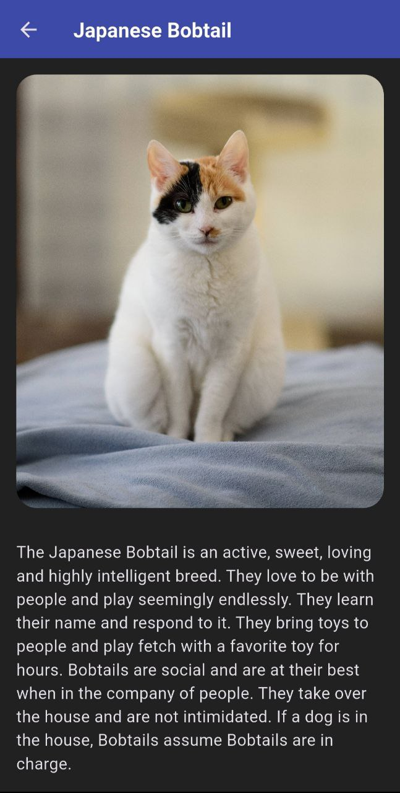

# Kinder - Tinder for Cats

## Описание проекта
Данный проект реализован в рамках курса "Разработка на Flutter" в ВШПИ. В рамках этого проекта нам было необходимо реализовать подобие тиндера, но для котов

### Реализованные фичи
- На главном экране отображается случайное изображение котика и название его породы
- Изображение котика можно свайпнуть или смахнуть влево или вправо
- Также есть две кнопки: лайк/дизлайк
- Смахивание, свайп или нажатие на кнопку сменяет котика на нового
- Если котика лайкнули (лайк или свайп вправо), то на экране увеличивается счетчик
- Счетчик можно обнулить с помощью кнопки
- Если нажать на само изображение котика, то открывается новый экран с детальным описанием
- На экране детального описания отображается то же изображение котика, плюс отображается вся информация про породу
- Есть пасхалка, что меняет API для котов на другую
- Для ее активации нужно 5 раз нажать на логотип, тогда счетчик лайков станет равен 999, это значит что пасхалка активировалась. Далее нужно просто свапать изображения котов, пока не случится что-то странное...

### Примеры
#### Светлая тема

#### Темная тема

### Ссылка на скачивание

<a href="https://minhaskamal.github.io/DownGit/#/home?url=https://github.com/ProgiFrogi/Kinder/blob/main/apk/kinder.apk" target="_blank">APK</a>